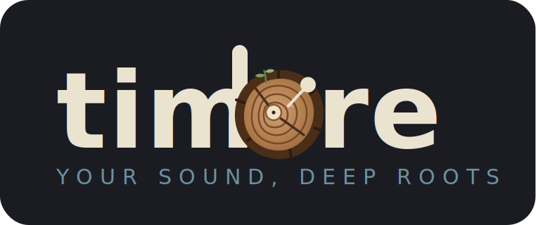
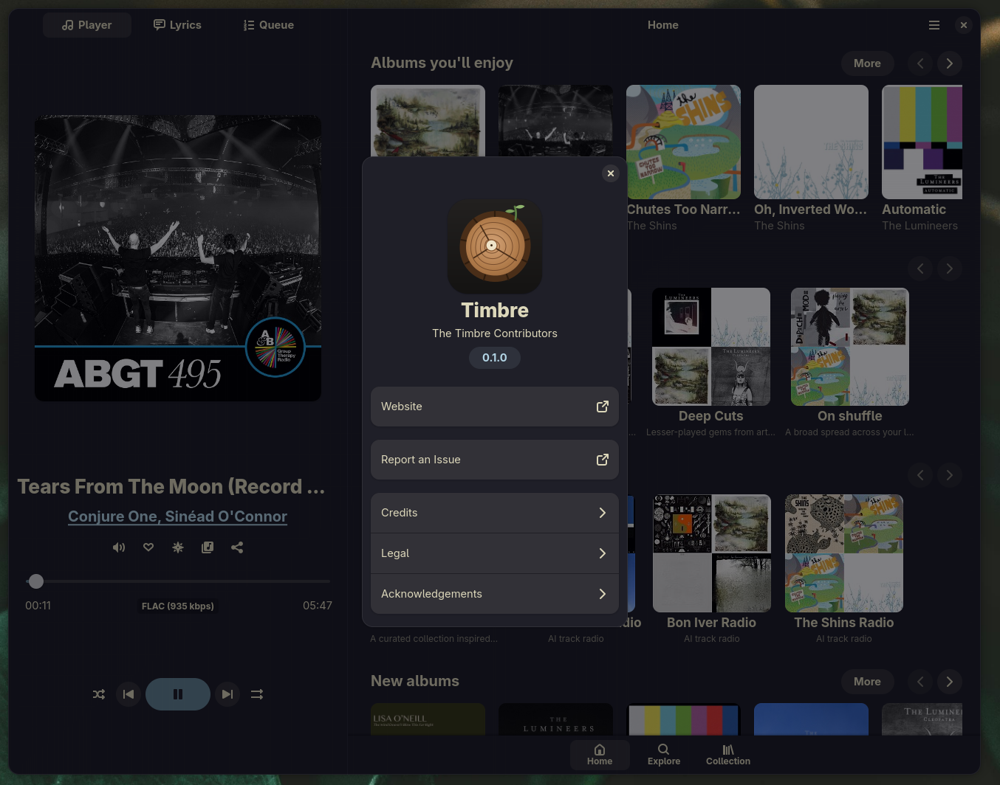

<p align="center">
  
</p>

<p align="center">
  <strong>Your sound, deep roots.</strong><br>
  A GTK4 / libadwaita music client for Jellyfin — the character of your sound, natively on Linux.
</p>

<p align="center">
  
  
  
  
</p>

---

Timbre browses and streams your Jellyfin music library through a native Adwaita
interface, with gapless playback, full desktop media integration, a sync-first
local library for fast offline browsing, and optional AI-assisted discovery that
only ever draws from **your** music.

> **Status:** 0.1.0 — feature-complete music client. Native build (Flatpak
> deferred to post-1.0). See [CHANGELOG.md](CHANGELOG.md).

## Screenshots

<p align="center">
  
</p>

## Features

- **Gapless playback** — seamless track-to-track transitions via GStreamer
  `playbin3` prefetch, no silence between album tracks.
- **Quick Connect login** — authorize from the Jellyfin web/app side with a code;
  no password typed into the client. Classic username/password login also works.
- **Background audio + MPRIS** — playback survives window close and integrates
  with GNOME/KDE media controls, lock-screen art, and play/pause/next from any
  MPRIS client (`org.mpris.MediaPlayer2.timbre`).
- **Queue management** — drag-to-reorder, per-row remove, play-next / add-to-queue,
  and a live queue view.
- **AI-powered discovery** — custom daily mixes, personal radio, AI track radio,
  ranked artist popularity, and artist bios that draw only from your own library
  (see [the dedicated section](#ai-powered-discovery-claude-openai-or-compatible)).

Plus a **sync-first SQLite library** for fast, offline-capable browsing, with
**Home / Explore / Collection** navigation, **artist / album / playlist / genre /
decade** pages, search, synced + static lyrics, year/decade filtering, and
favorites. Every UI surface reads from the local database and never blocks the
main loop.

## Building

**Runtime dependencies:**
- GTK 4.22+, libadwaita 1.9+
- GStreamer 1.28+ with `gst-plugins-base` (playbin3) plus the
  `gst-plugins-good` / `gst-plugins-bad` / `gst-libav` plugin sets for broad codec
  support (FLAC / AAC / MP3 / Vorbis / Opus)
- python-gobject (PyGObject), python-requests

**Build dependencies:**
- meson >= 0.62, ninja, blueprint-compiler
- glib-compile-resources / glib-compile-schemas (from glib2)

On Arch / CachyOS, the runtime + build deps:

```
sudo pacman -S gtk4 libadwaita python python-gobject python-requests gst-plugins-base gst-plugins-good gst-plugins-bad gst-libav meson ninja blueprint-compiler glib2
```

Configure and compile:

```
meson setup build
ninja -C build
```

Run from the source tree without installing:

```
./run-dev.sh
```

The script creates a `timbre → src/` symlink, compiles schemas into
`build/schemas/`, and launches with the correct `GSETTINGS_SCHEMA_DIR` and
`PYTHONPATH`.

## Installing

Install into your user prefix:

```
meson setup buildrel --prefix=$HOME/.local
ninja -C buildrel install
```

The binary lands at `~/.local/bin/timbre`; schemas, the icon cache, and the
desktop database are refreshed by meson post-install hooks. If `~/.local/bin`
is not on `PATH`, add `export PATH="$HOME/.local/bin:$PATH"`. Uninstall with
`ninja -C buildrel uninstall`.

**Arch / CachyOS package** — a `PKGBUILD` (pkgname `timbre`) is provided in
[`packaging/`](packaging/PKGBUILD). From a checkout:

```
cd packaging
makepkg -si
```

It builds from the local working tree via meson and pulls the GStreamer codec
plugins as dependencies.

## AI-Powered Discovery (Claude, OpenAI, or compatible)

Timbre's discovery features are **off by default** and only activate once you
configure a provider with your own API key in **Preferences**. It works with:

- **Anthropic Claude**
- **OpenAI**
- **Any OpenAI-compatible endpoint** — including self-hosted / local LLMs
  (Ollama, LM Studio, vLLM, etc.) — just point the endpoint at your server.

What you get when it's enabled:

- **AI track radio** — an endless station seeded from a track or artist, where
  every pick is validated against your local library by ID before it plays. The
  model never invents tracks; if it can't fill the station, Timbre falls back to
  Jellyfin's own **InstantMix**.
- **Four daily custom mixes** — fresh, themed mixes generated once per day from
  your listening and library.
- **Personal radio stations** — ongoing stations tuned to your taste.
- **Artist bios** — generated only when your Jellyfin server has none. Timbre
  **respects and reuses the server's own Overview** when it exists; optionally it
  can **push** generated bios back up to the server so other apps see them.
- **AI-ranked popular tracks** — a per-artist popularity ranking that refreshes
  when it goes stale (e.g. when new music for that artist appears).

**Privacy.** When discovery is enabled, only **text metadata — track, artist,
and genre *names* (plus years/genres)** — is sent to the endpoint you choose, so
the model can select and rank from a candidate list exported from your own
library. **No audio, no files, and no credentials leave your Jellyfin server.**
Every returned selection is validated against your local database before anything
plays. Your API key is stored in your system keyring (libsecret), never in plain
config. With no provider configured, nothing is sent anywhere and every discovery
surface falls back to local, on-device heuristics.

### External lyrics (LRCLIB)

When a song has no lyrics in Jellyfin, Timbre can look them up on
[LRCLIB](https://lrclib.net), a free community lyrics database. This is **on by
default** and toggled via **Fetch lyrics online (LRCLIB)** in Preferences. While
enabled, only the **track, artist, and album names** (and the track duration, to
improve matching) of the playing song are sent to `lrclib.net` — nothing else, no
audio or credentials. Results are cached locally. Turn the switch off to keep all
lyric lookups on your Jellyfin server only.

## Testing

Timbre is developed against a pytest suite (460+ tests over the pure-python
core: queue, sync, db, AI selection, lyrics parsing) plus a manual headless
GTK battery (leak gates, end-to-end flows, layout measurements under a
headless Wayland compositor). The development test tree is not part of the
release sources.

## Attribution

Timbre is based on [High Tide](https://github.com/Nokse22/high-tide) by Nokse22,
a GPL-3.0 TIDAL client. The application skeleton was ported with copyright headers
retained; the TIDAL API layer was fully replaced by a Jellyfin data layer, and the
sync-first SQLite library, AI discovery layer, and queue/onboarding work are
original to Timbre.

## License

GPL-3.0-or-later. See [COPYING](COPYING).

## Notes

- Flatpak packaging is deferred to post-1.0. See `build-aux/README.md`.
- i18n / po translation is deferred to post-1.0.
